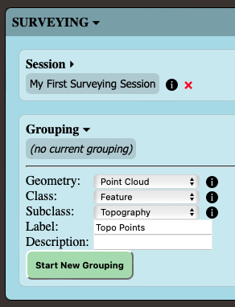
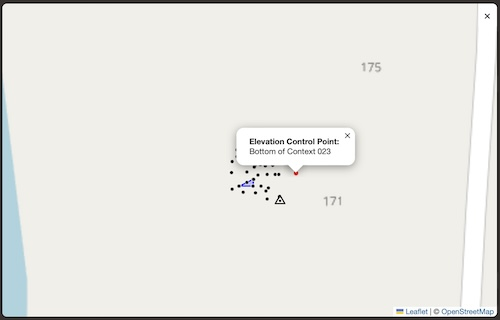

```
  ____   _                    _    ____         _         _           __        __     _     
 / ___| | |__    ___    ___  | |_ |  _ \  ___  (_) _ __  | |_  ___    \ \      / /___ | |__  
 \___ \ | '_ \  / _ \  / _ \ | __|| |_) |/ _ \ | || '_ \ | __|/ __| __ \ \ /\ / // _ \| '_ \ 
  ___) || | | || (_) || (_) || |_ |  __/| (_) || || | | || |_ \__ \ __  \ V  V /|  __/| |_) |
 |____/ |_| |_| \___/  \___/  \__||_|    \___/ |_||_| |_| \__||___/      \_/\_/  \___||_.__/ 
```


# Overview
ShootPoints-Web is a set of programs for total station surveying. Based on the [SiteMap](https://www.academia.edu/78544111/SiteMap_Innovations_in_Computer_Based_Mapping_for_Archaeologists) surveying package originally developed at the Museum Applied Science Center for Archaeology (MASCA) at the University of Pennsylvania Museum, ShootPoints-Web streamlines and simplifies total station operation and data collection on archaeological excavations. Developed independently, it was heavily tested and refined at the Penn Museum projects at Ur and [Lagash](https://web.sas.upenn.edu/lagash/), Iraq.

ShootPoints-Web consists of two interrelated projects: [shootpoints-web-api](https://github.com/Lugal-PCZ/shootpoints-web-api) and [shootpoints-web-frontend](https://github.com/Lugal-PCZ/shootpoints-web-frontend). Though shootpoints-web-api can be run from a laptop connected directly to the total station via a serial cable, it is intended to be installed on a dedicated Raspberry Pi mounted on the tripod of the total station, and controlled wirelessly via shootpoints-web-frontend in a web browser running on a smartphone or tablet on a local wifi network. Generic installation instructions are provided below, and detailed instructions for creating a headless Raspberry Pi ShootPoints-Web server are on the [repository Wiki](https://github.com/Lugal-PCZ/ShootPoints-Web/wiki).


# Why use ShootPoints-Web?
Most surveying software, whether running on the total station itself or on an external data collector, is made for surveyors, not archaeologists, and is often overly-complicated. Though the tools are the same, archaeologists’ needs are different than general land surveying, so ShootPoints-Web is designed for them. Its core principles are:

* **ShootPoints-Web records _archaeological_ data.**  
Archaeologists benefit from extensive metadata for their surveying points. ShootPoints-Web structures your workflow to facilitate that while shedding the tools that you’ll never need or use.  

* **ShootPoints-Web is easy to learn.**  
Tired of the typical on-site delay waiting for the *one* person who knows how to use your total station to be free so they can shoot your point elevations? ShootPoints-Web can be learned quickly and used by multiple team members, eliminating that bottleneck.  

* **ShootPoints-Web is easy to use on-site.**  
Setting up the total station should be the hardest part of surveying. Once that’s done, the rest of the job should be point-and-shoot. ShootPoints-Web imposes a workflow that reduces confusion and improves the quality of your surveying data.  

* **ShootPoints-Web is inexpensive.**  
ShootPoints-Web is open source and runs well on inexpensive computers and older total stations. Data collection is triggered from any excavator’s personal cellphone via a webapp. You can have a fully-functioning and high-quality surveying solution for about $1000.

[See ShootPoints-Web in action on YouTube.](https://youtu.be/kiFEff1Kne4)


# Requirements
Python 3.9 and later.

ShootPoints-Web’s processing and storage requirements are minimal, and it runs well on Raspberry Pi 2 Model B and better SBCs.

Serial communications protocols have only been created for Topcon GTS-300 series total stations, but ShootPoint Web’s modular design means that other makes and models of total station will be added in the future.

shootpoints-web-api requires the following third-party Python packages:
* [FastAPI](https://fastapi.tiangolo.com)
* [pySerial](https://github.com/pyserial/pyserial)
* [PyShp](https://github.com/GeospatialPython/pyshp)
* [Python-Multipart](https://github.com/andrew-d/python-multipart)
* [utm](https://github.com/Turbo87/utm)
* [Uvicorn](https://www.uvicorn.org)

shootpoints-web-frontend bundles the following third-party Javascript libraries:
* [Leaflet](https://leafletjs.com)
* [Leaflet.SvgShapeMarkers](https://github.com/rowanwins/Leaflet.SvgShapeMarkers)

# Quick Start
These instructions presume that you will be installing ShootPoints-Web on a laptop or desktop computer for initial testing purposes. Instructions for deploying ShootPoints-Web on a Raspberry Pi for fieldwork are on the [repository Wiki](https://github.com/Lugal-PCZ/ShootPoints-Web/wiki).

By default, ShootPoints-Web will launch in “demo” mode with no serial connection and simulated shot data so you can familiarize yourself with the software without a total station. However, if you do have a supported total station you can choose it in the program configs for testing with an actual live connection.

## Installation
If they’re not already in your system, install [python](https://www.python.org/downloads/) and [git](https://git-scm.com/downloads).

### Clone ShootPoints-Web into your project directory:
 ```bash
 git clone --recurse-submodules https://github.com/Lugal-PCZ/ShootPoints-Web.git
 cd ShootPoints-Web
 git submodule foreach git switch main
 ```
### Install the required Python packages:
```bash
cd api
pip3 install -r api/requirements.txt
```
### Start the ShootPoints-Web software:
```bash
uvicorn api:app --host 0.0.0.0
```

If you’re testing ShootPoints-Web on the same computer that it’s installed on, access its web interface at [http://localhost:8000/](http://localhost:8000/). To test it from a different device on the same network, open a web browser to [http://<ip.address.of.the.shootpoints.testbed>:8000/](http://<ip.address.of.the.shootpoints.testbed>:8000/).

## Data Management and Categorization
Following the model developed for SiteMap, ShootPoints-Web categorizes shot data to simplify its visualization and interpretation. The two primary categorizations are groupings (collections of geometrically related points) and class/subclass (archaeological metadata about the shots). All data are saved to a local database which can be downloaded *in toto* or exported as shapefiles via the web interface for easy inclusion in your project’s GIS.

ShootPoints-Web will not let you begin collecting data without the proper prerequisites (site, station coordinates, and surveying session).

### Groupings
Every measurement taken with ShootPoints-Web is part of a grouping, which can be any of the following four geometries:
* **Isolated Point**: A discrete point that encapsulates granular information such as a point elevation or the location of a small artifact.
* **Point Cloud**: Multiple non-sequential point samples that do not carry information individually but as elements of a group that together describe an entity (such as topography).
* **Open Polygon**: Multiple sequential points that trace an outline wherein the start and end points do not connect (such as in a shapefile linestring).
* **Closed Polygon**: Multiple sequential points that trace an outline wherein the start point is connected to the end point (such as in a shapefile polygon).

### Classes and Subclasses
Each grouping also is assigned a class and subclass to assist in categorization and visualization of the data collected. The following classes and subclasses are populated in the ShootPoints database with a fresh install, but new ones can be added and removed under the “Setup” panel, as is appropriate for your site.
* **Architecture**: Human-built structures.
  * **Floor**: Prepared surfaces upon which human activities took place.
  * **Wall**: Vertical, human-made, constructions that enclose, divide, or delimit space.
* **Artifact**: Objects made, modified, or used by people.
* **Feature**: Natural formations or immovable, non-architectural, human creations.
  * **Pit**: Hole or depression that cuts through lower stratigraphic layers.
  * **Topography**: Ground surface.
* **Operation**: Excavation units, controls, grids, and measurements.
  * **Elevation Control Point**: Control point for taking local elevations, as with a string and bubble level.
  * **GCP**: Photogrammetry ground control points.
  * **Grid**: Site or survey grid.
  * **Survey Station**: Benchmarks for survey station setup or backsights.
  * **Trench**: Excavation units.

## ShootPoints-Web Interface
ShootPoints-Web’s interface has six primary components:


1. **On-The-Fly Adjustments**: Click the arrows icon in the upper left to set atmospheric corrections and prism offsets, which may vary from one shot to the next.
2. **Utilities**: Click the gears icon in the upper right to download data, delete a surveying session, or reset the database. Also, if ShootPoints-Web is running on a Raspberry Pi, you will have options to safely shut it down or reboot it.
3. **Output Box**: The results of your commands will be displayed here.
4. **“Surveying” Panel**: Expand this area to collect data with the total station.
5. **Live Map Icon**: Click the map icon to view a map of your current surveying session.
6. **“Setup” Panel**: Expand this area to input values that should be set prior to beginning surveying such as total station configs, your site’s survey stations, and classes/subclasses.

## Save a new site:
1. Expand the “Setup” panel.
2. Enter a name for the new site.
3. (*optional*) Enter a description for the new site.
4. Click the “Save New Site” button.  


## Save a new station:
1. Choose the site where this survey station is located.
2. Enter a name for the new station.
3. (*optional*) Enter a description for the new station.
4. Choose the coordinate system.
5. Enter the station coordinates.
6. Click the “Save New Station” button.  


Add additional stations if you’re working with an existing site with multiple benchmarks with known coordinates.

## Start a new surveying session:
(*If you’re testing with a total station, be sure that it is set up properly, turned on, and connected to your computer’s serial port. Also verify that the proper serial port is selected under the “Set Configs” form of the “Setup” panel.*)
1. Expand the “Surveying” panel.
2. Enter a label for the new surveying session.
3. Enter your name or initials as the responsible surveyor.
4. Choose the site.
5. Enter the current temperature and pressure. ShootPoints-Web handles atmospheric corrections automatically.
6. Choose the session type:
   * **Azimuth**: You will set up on a pre-set station with known coordinates and aim the total station at a known landmark. ShooPoints-Web will set the azimuth on the total station.
     * Enter the azimuth to the known landmark and the height of the total station above the occupied point.
   * **Backsight**: You will set up on a pre-set station with known coordinates and shoot a backsight to a second pre-set station. ShootPoints-Web will calculate the instrument height and set the azimuth on the total station.
     * Select the backsight station and enter the height of the prism pole.
   * **Resection**: You will set up on an arbitrary point and shoot backsights to two pre-set stations with known coordinates. ShootPoints-Web will calculate the coordinates of the occupied point and set the azimuth on the total station.
     * Choose the two backsight stations and enter the height of the total station above the occupied point.
7. Sight the total station on the prism or landmark and click the “Set Instrument Azimuth,” “Shoot Backsight,” or “Shoot Left Backsight” button. (The button label will change, depending on the session type.)  
  
  
  
8. (*conditional*) If you’re starting a session by resection, sight on the prism at second backsight and click the “Shoot Right Backsight” button.

## Create a new grouping:
1. Select the appropriate geometry.
2. Select the class and subclass of this grouping.
3. Enter a label for the grouping.
4. (*optional*) Enter a description for the new grouping.
5. Click the “Start New Grouping” button.  



## Collect data:
1. Aim the total station at the prism.
2. Click the “Take Shot” button.  

3. While the shot is being taken, you can click the “Cancel Shot” button to abort.
4. After the shot data have been returned from the total station, you will be given the option to save the shot or discard the data.
5. (*optional*) When saving the shot, you can add a comment (such as “NE corner” or “Edge of marsh”) to assist your recollection and interpretation of the data.  


Continue taking shots, each of which will be saved to the current grouping. To begin taking shots in a new grouping, simply create a new grouping as described above. You can also end a grouping or session deliberately. (This is useful if multiple excavators are using the total station and you want to prevent the accidental addition of new shots to an existing grouping.)

Note that any grouping shot with an “Isolated Point” geometry can logically only have one shot saved to it, so if you’re taking a series of these (such as is typical of end-of-day point elevations in a trench), you will need to create a new grouping for each shot. Though this sounds cumbersome, in practice it is a quick process and ensures that your data are marked consistently.

## Monitor progress:
1. Clicking the map icon reveals a map showing the current surveying session.
2. The latest unsaved shot is shown in red.
3. Use familiar pinch and drag gestures to zoom and pan the map.
4. Click on any point, line, or polygon to see its subclass and label.
5. Click the “X” in the upper right of the map to return to the data collection interface.  


## Download data:
1. Click the gears icon in the upper right to open the Utilities panel.
2. Select the desired session under “Export Surveying Session Data.”
3. Click the “Export” button.  

4. Find the newly-downloaded “ShootPoints Data (*session name*).zip” file in your Downloads folder and unzip it.

The unzipped directory will be named “ShootPoints Data (*session name*)” with the following structure:

```
.
|-- gis_shapefiles
|    |-- allshots.dbf
|    |-- allshots.prj
|    |-- allshots.shp
|    |-- allshots.shx
|    |-- closedpolygons.dbf
|    |-- closedpolygons.prj
|    |-- closedpolygons.shp
|    |-- closedpolygons.shx
|    |-- openpolygons.dbf
|    |-- openpolygons.prj
|    |-- openpolygons.shp
|    |-- openpolygons.shx
|    |-- pointclouds.dbf
|    |-- pointclouds.prj
|    |-- pointclouds.shp
|    |-- pointclouds.shx
|    |-- spatialcontrol.dbf
|    |-- spatialcontrol.prj
|    |-- spatialcontrol.shp
|    |-- spatialcontrol.shx
|-- photogrammetry_gcps
|    |-- gcps_for_dronedeploy.csv
|    |-- gcps_for_metashape.csv
|    |-- gcps_for_pix4d.csv
|    |-- gcps_for_realitycapture.csv
|    |-- gcps_for_webodm.txt
|-- session_info.json
|-- shots_data.csv
```

The contents of the files are as follows:
* **gis_shapefiles**: Directory with shapefiles of the shots taken.
  * **allshots**: All the shots in the surveying session represented as _POINTZ_ objects.
  * **closedpolygons**: All shots in the surveying session with the “Closed Polygon” ShootPoints geometry represented as _POLYGONZ_ objects.
  * **openpolygons**: All shots in the surveying session with the “Open Polygon” ShootPoints geometry represented as _POLYLINEZ_ objects.
  * **pointclouds**: All shots in the surveying session with the “Point Cloud” ShootPoints geometry represented as _MULTIPOINTZ_ objects.
  * **spatialcontrol**: Setup and backsight stations for the current session represented as _POINTZ_ objects.
* **photogrammetry_gcps**: Directory with files of ground control points formatted for Photogrammetry processing. All shots taken with the ShootPoints class/subclass of Operation/GCP will be automatically added to these files.
  * **gcps_for_dronedeploy.csv**: CSV file of GCPs for importing into [DroneDeploy](https://www.dronedeploy.com).
  * **gcps_for_metashape.csv**: CSV file of GCPs for importing into [Agisoft Metashape](https://www.agisoft.com).
  * **gcps_for_pix4d.csv**: CSV file of GCPs for importing into [Pix4D](https://support.pix4d.com).
  * **gcps_for_realitycapture.csv**: CSV file of GCPs for importing into [RealityCapture](https://www.capturingreality.com).
  * **gcps_for_webodm.txt**: Text file of GCPs for importing into [WebODM](https://www.opendronemap.org/webodm/).
* **session_info.json**: Comprehensive metadata about the surveying session, including counts of the groupings and shots taken.
* **shots_data.csv**: All shots taken during the surveying session, saved as a flat CSV file.


# View Your Survey Data
* Add the GCPs to the photogrammetry program of your choosing to help create georeferenced 3D models and orthomosaics.
* Plot the shapefiles of your survey data in your project GIS. These can be imported directly, but [QGIS](https://qgis.org/) users can also install the [ShootPoints-Web Plotter plugin](https://plugins.qgis.org/plugins/shootpointswebplotter-main/) to quickly plot the downloaded shapefiles, styled beautifully.  

